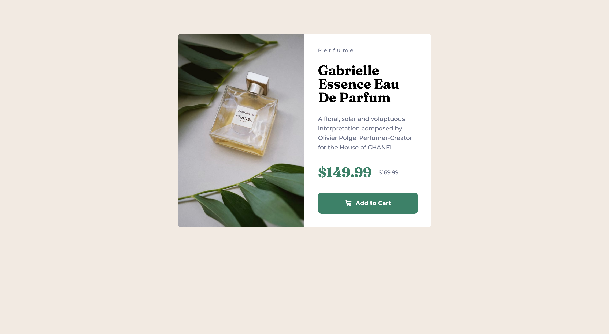

# Frontend Mentor - Product preview card component solution

This is a solution to the [Product preview card component challenge on Frontend Mentor](https://www.frontendmentor.io/challenges/product-preview-card-component-GO7UmttRfa). Frontend Mentor challenges help you improve your coding skills by building realistic projects.

## Table of contents

- [Overview](#overview)
  - [The challenge](#the-challenge)
  - [Screenshot](#screenshot)
  - [Links](#links)
- [My process](#my-process)
  - [Built with](#built-with)
  - [What I learned](#what-i-learned)
- [Author](#author)

## Overview

### The challenge

Users should be able to:

- View the optimal layout depending on their device's screen size
- See hover and focus states for interactive elements

### Screenshot



### Links

- Solution URL: [github.com/Michael-Andreas/product-preview-card-component](https://github.com/Michael-Andreas/product-preview-card-component)
- Live Site URL: [https://michael-andreas.github.io/product-preview-card-component/](https://michael-andreas.github.io/product-preview-card-component/)

## My process

### Built with

- Semantic HTML5 markup
- CSS custom properties
- Flexbox
- CSS Grid
- Mobile-first workflow

### What I learned

Learned how to display prices in an accesible and SEO friendly way.

I also now know when to use the del tag in HTML, for example for the old price of an item when its striketrough

Also learned how to change the displayed Image depending on the size of the viewport.

```html
<div
  class="product-price"
  itemprop="offers"
  itemscope
  itemtype="https://schema.org/Offer">
  <meta itemprop="priceCurrency" content="USD" />
  <meta itemprop="price" content="149.99" />
  <span class="sr-only"> $149.99 US dollars </span>
  <div class="price">
    <span class="price-currency" aria-hidden="true">$</span>
    <span itemprop="price" aria-hidden="true">149.99</span>
  </div>
  <del class="price-old" aria-label="Original price">$169.99</del>
</div>
```

```html
<picture>
  <source
    media="(min-width: 37.5rem)"
    srcset="./images/image-product-desktop.jpg"
    alt="Gabrielle Essence Eau de Parfum" />
  
</picture>
```

## Author

- Website - [www.michaelandreas.de](www.michaelandreas.de)
- Frontend Mentor - [@Michael-Andreas](https://www.frontendmentor.io/profile/Michael-Andreas)
